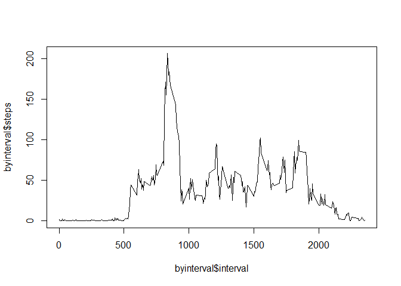

Objective:
----------

This assignment analyses "activity monitoring data", looking at total
numbers of activity each day and average daily activity pattern. It also
looks at the effect of missing values and effect of imputing them by the
mean activity rate.Lastly, it looks for pattern in activity divided into
weekdays and weekends.

Loading and Preprocessing data
------------------------------

    actvdata<-read.csv("./data/activity.csv",header = TRUE, sep = ",")#loading csv file from data folder of home drive
    str(actvdata)

    ## 'data.frame':    17568 obs. of  3 variables:
    ##  $ steps   : int  NA NA NA NA NA NA NA NA NA NA ...
    ##  $ date    : Factor w/ 61 levels "2012-10-01","2012-10-02",..: 1 1 1 1 1 1 1 1 1 1 ...
    ##  $ interval: int  0 5 10 15 20 25 30 35 40 45 ...

    actvdata$date<-as.Date(actvdata$date)#formatting as date
    str(actvdata$date)

    ##  Date[1:17568], format: "2012-10-01" "2012-10-01" "2012-10-01" "2012-10-01" ...

Total Number of Steps per day
-----------------------------

    library(dplyr)#loading dplyr package

    ## 
    ## Attaching package: 'dplyr'

    ## The following objects are masked from 'package:stats':
    ## 
    ##     filter, lag

    ## The following objects are masked from 'package:base':
    ## 
    ##     intersect, setdiff, setequal, union

    bydate<-summarise(group_by(actvdata,date),totalsteps=sum(steps))#getting total steps by date
    head(bydate)

    ## Source: local data frame [6 x 2]
    ## 
    ##         date totalsteps
    ##       (date)      (int)
    ## 1 2012-10-01         NA
    ## 2 2012-10-02        126
    ## 3 2012-10-03      11352
    ## 4 2012-10-04      12116
    ## 5 2012-10-05      13294
    ## 6 2012-10-06      15420

    hist(bydate$totalsteps)#making histogram of total steps by date

<!-- -->

    mean(bydate$totalsteps,na.rm = TRUE)#mean of total stpes

    ## [1] 10766.19

    median(bydate$totalsteps,na.rm = TRUE)#median of total steps

    ## [1] 10765

Average Daily Activity Pattern
------------------------------

    intstepsdf<-actvdata[,c(3,1) ]#subsetting a datframe with interval and steps only
    head(intstepsdf)

    ##   interval steps
    ## 1        0    NA
    ## 2        5    NA
    ## 3       10    NA
    ## 4       15    NA
    ## 5       20    NA
    ## 6       25    NA

    byinterval<-aggregate(.~interval, data=intstepsdf, mean)# mean steps by interval
    head(byinterval)

    ##   interval     steps
    ## 1        0 1.7169811
    ## 2        5 0.3396226
    ## 3       10 0.1320755
    ## 4       15 0.1509434
    ## 5       20 0.0754717
    ## 6       25 2.0943396

    plot(byinterval$steps~byinterval$interval,type="l")#plotting timeseries of mean steps

<!-- -->

    byinterval[byinterval$steps==max(byinterval$steps),]#max mean step by interval

    ##     interval    steps
    ## 104      835 206.1698

Imputing Missing Values
-----------------------

    sum(is.na(actvdata$steps))#total NA's

    ## [1] 2304

    for (i in 1:nrow(actvdata)){
      if(is.na(actvdata$steps[i])){
        actvdata$steps[i]<-round(byinterval[byinterval$interval==actvdata$interval[i],2])}}#replacing NA's of steps in actvdata with mean steps of same interval from byinterval df

    sum(is.na(actvdata$steps))#checking for NA's

    ## [1] 0

    clnbydate<-summarise(group_by(actvdata,date),totalsteps=sum(steps))#getting total steps by date of NA imputed data

    hist(clnbydate$totalsteps)#histogram of cleaned steps

<!-- -->

    mean(clnbydate$totalsteps)# mean of cleaned steps

    ## [1] 10765.64

    median(clnbydate$totalsteps)#median of cleaned steps

    ## [1] 10762

### Impact of Imputing Missing Data

Looking at the two histograms we can see that, the middle bin of 10000
to 15000 is taller for the cleaned data, and this is due to inputting
more values of that range instead of missing values. We also see that
median and mean becomes same for cleaned data, this due to having a lot
of values with mean value, hence median the middle value becomes one of
them.

Difference between Weekend and Weekday Activity Pattern
-------------------------------------------------------

    weekdays(clnbydate$date[1:10])#creating a new column "days"(Weekday & Weekend) in actvdata df

    ##  [1] "Monday"    "Tuesday"   "Wednesday" "Thursday"  "Friday"   
    ##  [6] "Saturday"  "Sunday"    "Monday"    "Tuesday"   "Wednesday"

    for (i in 1:nrow(actvdata)){
      if(weekdays(actvdata$date[i])=="Saturday"|weekdays(actvdata$date[i])=="Sunday"){
        actvdata$days[i]<-"Weekend"}
      else {actvdata$days[i]<-"Weekday"
        
      }
    }
    head(actvdata)

    ##   steps       date interval    days
    ## 1     2 2012-10-01        0 Weekday
    ## 2     0 2012-10-01        5 Weekday
    ## 3     0 2012-10-01       10 Weekday
    ## 4     0 2012-10-01       15 Weekday
    ## 5     0 2012-10-01       20 Weekday
    ## 6     2 2012-10-01       25 Weekday

    intdayssteps<-summarise(group_by(actvdata,interval,days),meansteps=round(mean(steps)))#geting the mean steps for cleaned data
    head(intdayssteps)

    ## Source: local data frame [6 x 3]
    ## Groups: interval [3]
    ## 
    ##   interval    days meansteps
    ##      (int)   (chr)     (dbl)
    ## 1        0 Weekday         2
    ## 2        0 Weekend         0
    ## 3        5 Weekday         0
    ## 4        5 Weekend         0
    ## 5       10 Weekday         0
    ## 6       10 Weekend         0

    library(ggplot2)#loading ggplot2 package

    p<- ggplot(intdayssteps, aes(x=interval, y=meansteps, color = days)) +
      geom_line() +
      facet_wrap(~days, ncol = 1, nrow=2)#creating the weekend/weekday activity timeseries
    print(p)#plotting it

<!-- -->

### Interpretation of the plot

From the time series plots of activity for weekdays and weekends, we can
see that the subject is more active during weekends, but the highest
activity happens on a weekday.
